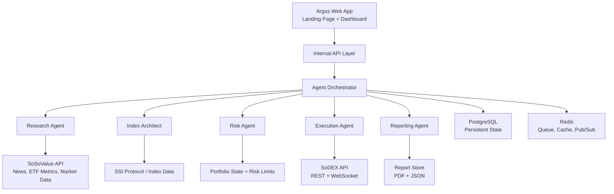

# Argus System Architecture Plan

## 1. Executive Summary

Argus is my AI hedge fund operating system for the SoSoValue Buildathon. I designed it around a simple idea: a single fund manager should be able to run the core workflow of a small crypto fund from one intelligent command center.

The system coordinates five specialist agents across the full investment lifecycle:

- Research Agent for market intelligence and narrative discovery.
- Index Architect for translating narratives into portfolio exposure.
- Risk Agent for validating allocation changes before execution.
- Execution Agent for SoDEX order intent, simulation, and trade logging.
- Reporting Agent for investor-ready performance commentary and attribution.

The product is built to show a complete workflow from data input to actionable output. SoSoValue provides the intelligence layer, SSI Protocol supports index and exposure logic, and SoDEX provides the path toward on-chain execution. The current implementation focuses on a polished Wave 1 demo, while the architecture is structured so the same product can mature into a real agentic finance platform through Waves 2 and 3.

## 2. Product Goal

My goal with Argus is to demonstrate how agentic finance can compress the operating stack of a hedge fund into a system that one person can realistically control.

Instead of building another signal dashboard, Argus is structured as a workflow OS:

1. Pull market intelligence from SoSoValue.
2. Convert news, flows, and market context into ranked narratives.
3. Map those narratives into index exposure or custom portfolio baskets.
4. Validate risk before any capital movement.
5. Route approved execution through SoDEX.
6. Produce a clean investor report that explains what happened and why.

This gives the project a clear judging story: real user value, working product logic, visible API integration, and a demo flow that ends in a concrete action.

## 3. Target User

The primary user is a solo crypto fund manager or independent portfolio operator who needs institutional-grade workflow without a large team.

Secondary users include:

- DAO treasury managers.
- Small crypto-native investment teams.
- DeFi power users managing systematic index exposure.
- Builders who want to create agentic portfolio tools on top of SoSoValue and SoDEX.

The interface is intentionally designed for a manager, not a retail trader. The product language focuses on allocation, risk gates, exposure, thesis, execution logs, and investor reporting.

## 4. Architecture Principles

I am using the following principles to keep the system credible and extensible:

- Data provenance first: every recommendation should show where the signal came from.
- Risk before execution: no trade flow should bypass risk validation.
- Human confirmation for capital movement: agents can recommend and prepare actions, but the manager approves execution.
- Modular agents: each agent owns a clear responsibility and produces structured output.
- Progressive integration: Wave 1 can run with mock data where access is pending, but the data contracts are shaped for real SoSoValue and SoDEX integration.
- Auditability: portfolio proposals, risk checks, order intents, and reports should be logged as versioned events.
- Demo clarity: judges should understand the end-to-end flow within the first minute.

## 5. High-Level System Design



At a high level, the browser only owns presentation and manager interaction. API keys, execution signing, agent orchestration, and persistence should live server-side.

## 6. Current Application Structure

The current prototype is a Vite React application with a landing page and dashboard shell.

Routes:

- `/`: landing page that explains the product, agent model, workflow, and SoSoValue ecosystem fit.
- `/dashboard`: command center for the live demo workflow.

Important frontend files:

- `src/pages/LandingPage.tsx`: premium landing page and product positioning.
- `src/App.tsx`: lightweight route handling and dashboard tab state.
- `src/components/layout/DashboardShell.tsx`: dashboard frame, navigation, animation setup.
- `src/components/layout/TopBar.tsx`: product identity, agent status, wallet action.
- `src/components/layout/Sidebar.tsx`: navigation across operational areas.
- `src/lib/mock-data.ts`: realistic demo data until live API access is connected.

Public assets:

- `public/argus-logo.svg`: primary vector logo.
- `public/argus-logo.jpeg`: JPEG logo export for sharing and submissions.
- `public/favicon.svg`: browser favicon.

## 7. Dashboard Information Architecture

### 7.1 Global Shell

The dashboard is organized as an operational terminal.

Global elements:

- Product identity and version.
- Agent status bar.
- Live timestamp.
- Wallet connection action.
- Sidebar navigation.
- System health panel.

Navigation sections:

- Intelligence
- Portfolio
- Global Macro
- Risk Monitor
- Execution
- Investor Reports

### 7.2 Intelligence View

Purpose:

The Intelligence view is where the Research Agent turns SoSoValue inputs into ranked narratives.

Core content:

- Narrative title.
- Category.
- Timestamp.
- Source count.
- Momentum score.
- Sentiment or risk direction.
- Human-readable summary.
- Portfolio implication.

Expected agent output:

```ts
type ResearchBrief = {
  id: string;
  title: string;
  category: string;
  summary: string;
  momentumScore: number;
  confidence: number;
  affectedAssets: string[];
  sourceCount: number;
  sources: Array<{
    provider: "SoSoValue" | "External";
    type: "news" | "market_data" | "etf_metric" | "index_data";
    url?: string;
    releasedAt?: string;
  }>;
  portfolioImplication: string;
};
```

### 7.3 Portfolio View

Purpose:

The Portfolio view is where the Index Architect converts an active narrative into a target allocation.

Core content:

- Current weights.
- Proposed weights.
- Allocation delta.
- Index or asset basket mapping.
- Strategy rationale.
- Confidence score.
- Approval control.

Expected output:

```ts
type PortfolioProposal = {
  id: string;
  narrativeId: string;
  status: "draft" | "awaiting_risk_review" | "risk_cleared" | "approved" | "rejected";
  allocations: Array<{
    symbol: string;
    targetWeight: number;
    currentWeight: number;
    reason: string;
  }>;
  expectedRisk: {
    volatility30d: number;
    maxDrawdownEstimate: number;
    liquidityScore: number;
  };
  managerEditable: boolean;
};
```

### 7.4 Risk Monitor View

Purpose:

The Risk Monitor is the control layer between recommendation and execution. It ensures that no portfolio change moves forward without checking concentration, drawdown, volatility, correlation, and liquidity.

Core checks:

- Maximum single-asset exposure.
- Sector or narrative concentration.
- Estimated drawdown.
- VaR estimate.
- Correlation drift.
- Liquidity score.
- Stress scenario impact.

Expected output:

```ts
type RiskGateResult = {
  proposalId: string;
  status: "pass" | "warning" | "fail";
  severity: "low" | "medium" | "high" | "critical";
  checks: Array<{
    name: string;
    result: "pass" | "warning" | "fail";
    limit: number;
    observed: number;
  }>;
  recommendation: string;
};
```

### 7.5 Execution View

Purpose:

The Execution view converts approved allocation deltas into SoDEX order intent. In Wave 2, this becomes the testnet execution layer.

Core content:

- Orderbook depth.
- Order intent.
- Estimated slippage.
- Route or venue.
- Signature status.
- Fill status.
- Execution log.

Expected output:

```ts
type ExecutionIntent = {
  proposalId: string;
  venue: "SoDEX testnet" | "SoDEX mainnet";
  mode: "simulation" | "live";
  orders: Array<{
    clOrdID: string;
    symbol: string;
    side: "BUY" | "SELL";
    type: "MARKET" | "LIMIT";
    quantity: string;
    price?: string;
    estimatedSlippageBps: number;
  }>;
  requiresManagerConfirmation: boolean;
};
```

### 7.6 Investor Reports View

Purpose:

The Reporting Agent turns operational data into an investor-ready explanation. This is important because the product is not just about finding trades; it is about running a fund process.

Core content:

- Weekly performance brief.
- PnL summary.
- Narrative attribution.
- Best and worst contributors.
- Risk commentary.
- PDF export state.

Expected output:

```ts
type InvestorReport = {
  id: string;
  periodStart: string;
  periodEnd: string;
  nav: number;
  pnl: number;
  sharpe?: number;
  maxDrawdown?: number;
  attribution: Array<{
    narrative: string;
    contributionBps: number;
    explanation: string;
  }>;
  commentary: string;
  exportStatus: "draft" | "generated" | "failed";
};
```

## 8. Data Integration Plan

### 8.1 SoSoValue API

SoSoValue is the primary source for market intelligence and narrative inputs.

Planned endpoints:

- Featured news feed by currency:
  - `GET https://openapi.sosovalue.com/api/v1/news/featured/currency`
  - Used by the Research Agent to identify market-moving narratives.

- ETF historical inflow chart:
  - `POST https://api.sosovalue.xyz/openapi/v2/etf/historicalInflowChart`
  - Used for institutional flow context, especially BTC and ETH ETF flows.

- Current ETF data metrics:
  - `POST https://api.sosovalue.xyz/openapi/v2/etf/currentEtfDataMetrics`
  - Used for current dashboard metrics and narrative confirmation.

Authentication:

- Use `x-soso-api-key`.
- API key must stay server-side.
- The frontend should call an internal route such as `/api/sosovalue/news`.

### 8.2 SSI Protocol / Index Data

SSI Protocol and SoSoValue index data support the allocation layer. The Index Architect uses this layer to map a narrative to investable exposure.

Example model:

```ts
type IndexExposure = {
  id: string;
  symbol: string;
  name: string;
  category: "btc" | "eth" | "defi" | "rwa" | "ai" | "stablecoin" | "custom";
  assets: Array<{ symbol: string; weight: number }>;
  price: number;
  change24h: number;
  volatility30d: number;
  liquidityScore: number;
};
```

### 8.3 SoDEX API

SoDEX is the execution layer. I plan to start with testnet to keep the demo safe and verifiable.

Known endpoint groups:

- Testnet REST spot: `https://testnet-gw.sodex.dev/api/v1/spot`
- Testnet REST perps: `https://testnet-gw.sodex.dev/api/v1/perps`
- Testnet WebSocket spot: `wss://testnet-gw.sodex.dev/ws/spot`
- Testnet WebSocket perps: `wss://testnet-gw.sodex.dev/ws/perps`
- Mainnet REST spot: `https://mainnet-gw.sodex.dev/api/v1/spot`
- Mainnet REST perps: `https://mainnet-gw.sodex.dev/api/v1/perps`

Execution safety requirements:

- Use testnet first.
- Use a separate API wallet for execution.
- Maintain nonce state server-side.
- Store every order intent before submission.
- Store payload hash, signature, request body, and response.
- Represent decimal fields as strings for signing payloads.
- Require manager confirmation before submitting any live order.

## 9. Backend Architecture Plan

Wave 1 can run primarily in the frontend with mock data and documented API contracts. For a production-ready system, I would introduce a backend that separates orchestration, data access, and execution safety.

Recommended backend modules:

- `market-data-service`: SoSoValue ingestion and normalization.
- `agent-orchestrator`: schedules and coordinates the five agents.
- `portfolio-service`: stores proposals, allocations, and version history.
- `risk-service`: runs risk checks and stress scenarios.
- `execution-service`: owns SoDEX integration, signing workflow, and execution ledger.
- `reporting-service`: generates investor report JSON and PDFs.
- `auth-service`: wallet login, sessions, and API permissions.

Recommended infrastructure:

- Node.js with Fastify or Express for the API.
- PostgreSQL for persistent records.
- Redis for queues, caching, and pub/sub.
- BullMQ for scheduled agent jobs.
- Object storage for generated reports.
- Docker Compose for Waves 1 and 2.
- Managed deployment or Kubernetes for Wave 3 if the project moves beyond the buildathon.

## 10. Persistence Model

The system should persist every major decision and state transition.

Core tables:

- `users`
- `wallets`
- `agent_runs`
- `narratives`
- `portfolio_proposals`
- `portfolio_allocations`
- `risk_gate_results`
- `execution_intents`
- `orders`
- `fills`
- `reports`
- `audit_events`

Audit events are especially important because the product touches financial decisions. A manager should be able to answer:

- What signal created this proposal?
- Which agent generated it?
- What data was used?
- What risk checks passed or failed?
- Who approved the execution?
- What was submitted to SoDEX?
- What was filled, cancelled, or rejected?

## 11. Security and Risk Controls

Security is part of the product design, not an afterthought.

Planned controls:

- Keep API keys on the backend.
- Use environment variables or managed secrets.
- Require wallet signature for account access.
- Do not store private keys in the browser.
- Require explicit confirmation for execution.
- Default to testnet for demo trading.
- Use rate limits on API routes.
- Log every execution action.
- Validate all agent outputs against schemas before using them.
- Treat AI output as advisory until risk and manager approval are complete.

## 12. Wave Roadmap

### Wave 1: Concept and Core Flow

Objective:

Demonstrate the Research to Portfolio workflow with a polished product interface.

Scope:

- Landing page.
- Dashboard shell.
- Research narrative feed.
- Portfolio proposal panel.
- Manager approval UI.
- Documented architecture.
- Realistic SoSoValue-shaped data model.

### Wave 2: Risk and Execution

Objective:

Add risk validation and SoDEX testnet execution simulation.

Scope:

- Risk Agent output.
- Stress tests.
- Execution intent model.
- SoDEX testnet adapter.
- Order ledger.
- WebSocket readiness for live order status.

### Wave 3: Reporting and Product Hardening

Objective:

Complete the full operating system flow.

Scope:

- Reporting Agent.
- PDF export.
- Persistent backend.
- Wallet auth.
- Audit log.
- Portfolio version history.
- Final demo polish.

## 13. Judge Demo Flow

The demo should follow this path:

1. Open the landing page.
2. Launch the dashboard.
3. Review a SoSoValue-derived market narrative.
4. See the Index Architect convert the narrative into allocation changes.
5. Review the risk state.
6. Approve the proposed allocation.
7. Simulate or submit a SoDEX testnet order intent.
8. Generate an investor-facing summary of the decision.

This flow directly addresses the judging criteria:

- User value: one-person fund workflow.
- Functionality: working dashboard and clear actions.
- Logic: visible agent handoffs.
- Data/API integration: SoSoValue, SSI, and SoDEX paths.
- UX clarity: manager-oriented command center.

## 14. References

- PRD: `ARGUS_PRD.md`
- SoSoValue API authentication: https://sosovalue.gitbook.io/soso-value-api-doc/authentication
- SoSoValue featured news by currency: https://sosovalue.gitbook.io/soso-value-api-doc/api-document/get-the-featured-news-feed-by-currency
- SoSoValue ETF historical inflow chart: https://sosovalue.gitbook.io/soso-value-api-doc/api-document/get-etf-historical-inflow-chart
- SoSoValue current ETF data metrics: https://sosovalue.gitbook.io/soso-value-api-doc/api-document/get-current-etf-data-metrics
- SoDEX API overview: https://sodex.com/documentation/api/api
- SSI Protocol repo: https://github.com/SoSoValueLabs/ssi-protocol
